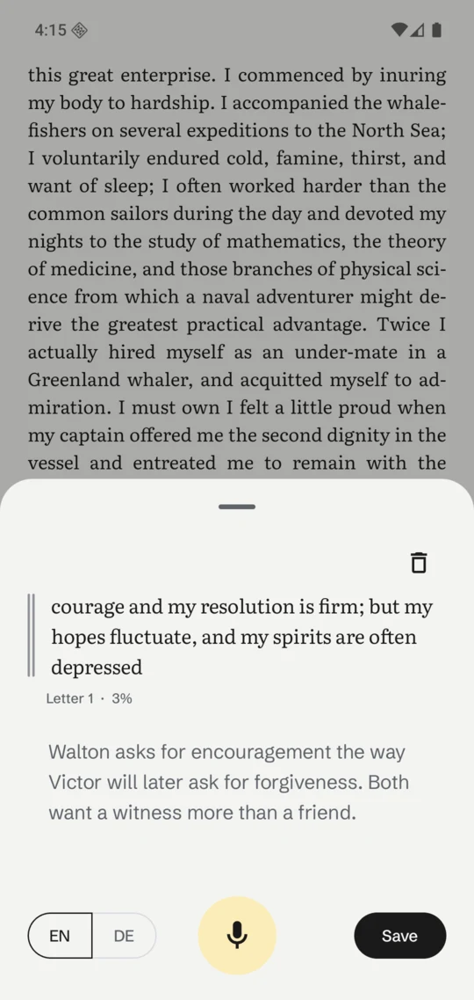
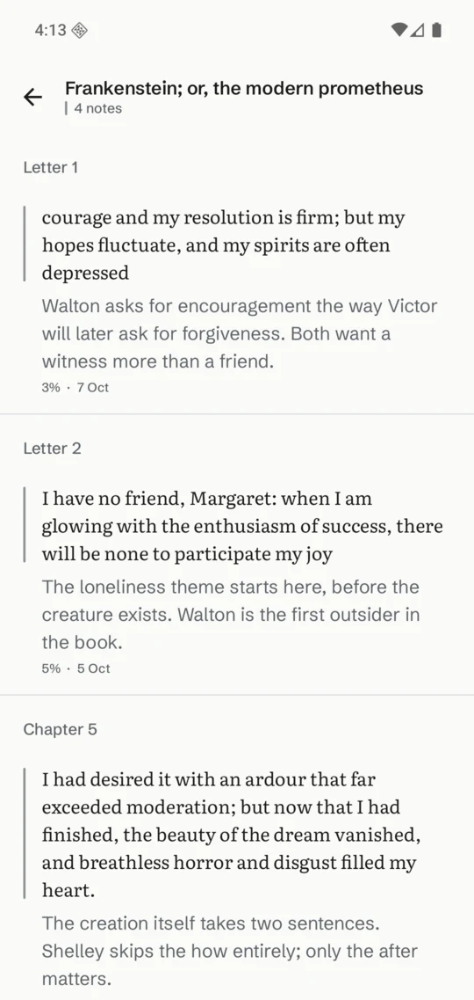
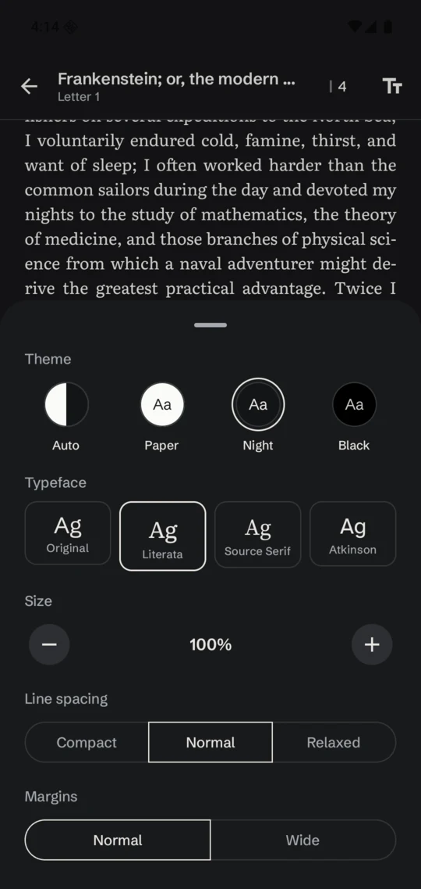

<h1 align="center">Reed</h1>

<p align="center">
  <strong>An Android e-reader for people who write in the margins.</strong><br>
  Select a passage, say or type what it made you think, and find every passage and note again in one place.
</p>

<p align="center">
  <a href="https://apps.obtainium.imranr.dev/redirect?r=obtainium://add/https://github.com/cbrasser/reed"></a>
</p>

<table>
  <tr>
    <td width="33%"></td>
    <td width="33%"></td>
    <td width="33%"></td>
  </tr>
  <tr>
    <td align="center"><sub>Your shelf</sub></td>
    <td align="center"><sub>Notes live in the margin</sub></td>
    <td align="center"><sub>Say it or type it</sub></td>
  </tr>
</table>

## Why Reed

Most readers treat notes as an afterthought: a highlighter colour, a tiny text box, a menu three taps deep. Reed is built the other way round. Reading stays quiet and full-screen, and the moment something strikes you, the note is one selection and one tap away, with a big microphone button so you can just say it.

Your own words are always set in graphite, the book's in ink, so you can tell them apart on every screen.

## Features

**Notes beside the text**
- Select any passage and tap **Note**, or note a whole page.
- Noted passages get a thin graphite stroke in the margin and a fine underline: present, never in the way.
- Tap the stroke to reread, edit or delete the note.

**Dictation that's actually one tap**
- Big mic button in the note sheet; with a speech service installed, words appear as you speak.
- Switch between **English and German** per note.
- Uses the phone's speech service, or a private on-device app like FUTO Voice Input (works on GrapheneOS).

**Listen to the book**
- Tap the headphones to have the book read aloud, sentence by sentence; pages turn with the voice and a dotted line marks the sentence being read.
- Keeps going with the screen off or the book closed, with controls in the notification, on the lock screen and on headphones.
- Remembers where it stopped: play again and it picks up at that sentence, or at the top of the page you've turned to.
- Reed's own voices for German and English, downloaded once (with progress) the first time a book needs one, and run on the phone. Otherwise the phone's speech engine. EPUB only.
- If a book declares the wrong language, change it in the book's options (long-press in the library); that also fixes its hyphenation and the dictation default.

**Every note, in context**
- All passage and note pairs for a book, grouped by chapter, in reading order.
- Open them from inside the reader or from the library; tap one to jump straight back to that spot.

**Reading, your way**
- EPUB and PDF.
- Paper, Night and Black themes, designed for each rather than inverted.
- Literata, Source Serif, Atkinson Hyperlegible or the book's own typeface; size, line spacing and margins.
- Keeps the book's own layout, with hyphenation so justified text doesn't leave gaps.

**Private books**
- Hide a book and its notes from the library, search and Reading now.
- Unlock with fingerprint or your screen lock; everything locks again when you leave the app, and private screens stay blank in recent apps.

**Your notes and books on your Nextcloud (optional)**
- Off until you turn it on: library menu › Send notes to Nextcloud. You sign in on your Nextcloud's own page; Reed never sees your password.
- Notes stay in step with the [home](https://github.com/cbrasser/home) desktop app, which files each book as a Markdown note: what you write here shows up there, and edits or deletions there come back here.
- Optionally the books themselves too: a backup on your Nextcloud, and books added on another phone appear on this one.
- Private books stay on the phone unless you include them.

<table>
  <tr>
    <td width="33%"></td>
    <td width="33%"></td>
    <td width="33%"></td>
  </tr>
  <tr>
    <td align="center"><sub>Every note, by chapter</sub></td>
    <td align="center"><sub>Night theme</sub></td>
    <td align="center"><sub>Reading settings</sub></td>
  </tr>
</table>

## Install

Reed needs **Android 11 or newer**.

**With [Obtainium](https://github.com/ImranR98/Obtainium)** (recommended, gets updates automatically): tap the badge above on your phone, or in Obtainium choose **Add app** and enter `https://github.com/cbrasser/reed`.

**Manually:** download the APK from the [latest release](https://github.com/cbrasser/reed/releases/latest) and open it.

Every release is signed with the same key, so updates install over each other and keep your notes. If you installed a build signed with a different key, uninstall it once first; that deletes its notes.

### Dictation on phones without Google

Reed listens through Android's speech-recognition service. If your phone has none (GrapheneOS, LineageOS without Google), install [FUTO Voice Input](https://voiceinput.futo.org/): Reed opens its "speak now" screen and drops the text into your note, fully on-device, in English and German.

### Voices for reading aloud

Reed brings its own voices ([Piper](https://github.com/rhasspy/piper) models, run with [sherpa-onnx](https://github.com/k2-fsa/sherpa-onnx)): Thorsten for German and Cori for English, about 116 MB each. The first time a book in one of those languages is read aloud and the phone has no voice for it, Reed offers to download it and starts reading when it's ready. Library menu › Read-aloud voices lists them, to download one ahead of time or delete it. A downloaded voice is preferred over the phone's own engine; other languages use the phone's engine. Reed's voices need a 64-bit ARM phone.

## Formats

| Format | Reading | Passage notes | Page notes |
|---|---|---|---|
| EPUB 2 / EPUB 3 | ✓ | ✓ | ✓ |
| PDF | ✓ | n/a | ✓ |
| MOBI / AZW3 | Convert to EPUB with [Calibre](https://calibre-ebook.com/) | | |

DRM-protected books can't be opened.

## Building

```bash
JAVA_HOME=/opt/homebrew/opt/openjdk@21/libexec/openjdk.jdk/Contents/Home ./gradlew :app:assembleDebug
```

Kotlin, Jetpack Compose and Material 3, with the [Readium Kotlin toolkit](https://github.com/readium/kotlin-toolkit) for rendering, Room for storage, Android's `SpeechRecognizer` for dictation and [sherpa-onnx](https://github.com/k2-fsa/sherpa-onnx) for Reed's voices (its AAR is fetched and checksum-verified by the `fetchSherpa` Gradle task on the first build). Requires JDK 21 and the Android SDK (compileSdk 37). The design system is documented in [`DESIGN.md`](DESIGN.md).

### Releasing

```bash
scripts/release.sh 0.2.0
```

Tags `v0.2.0`, builds a signed APK, checks the signature, pushes the tag and publishes a GitHub release that Obtainium picks up. The version name comes from the tag and the version code from the commit count. The signing key stays on the maintainer's machine.

## License

Reed is free software under the [GNU General Public License v3.0](LICENSE): you can use, study, share and modify it, and versions you distribute must stay under the same licence.

## Credits

Book covers and text in the screenshots are public-domain editions from [Project Gutenberg](https://www.gutenberg.org/). Bundled fonts (Schibsted Grotesk, Literata, Source Serif 4, Atkinson Hyperlegible Next) are under the SIL Open Font License; their licences are in `app/src/main/assets/fonts/`.
